# Database Schema (Detailed Design)

## Status

This document is the **proposed relational-schema source of truth** for
NetPDBFF's future implementation. It is detailed enough to write migrations
from, but **no migrations or SQL exist yet** — this is documentation only.
It extends, and must be read alongside, `docs/database-model.md` (conceptual
model), `docs/privacy-model.md`, `docs/user-roles.md`, and
`docs/controlled-vocabularies.md`. Where this document and
`docs/database-model.md` overlap, this document is the more detailed and
authoritative one; `docs/database-model.md` stays intentionally conceptual.

Nothing here should be treated as final. Items that need a product-owner or
legal decision before migrations are written are called out inline and
collected in the closing summary delivered alongside this document.

## Conventions

To avoid repeating boilerplate on every table, the following apply
everywhere unless a table's entry says otherwise:

- **Primary keys** are `id uuid`, default `gen_random_uuid()`.
- **Timestamps** are `timestamptz`. Every table has `created_at` (default
  `now()`) and, where rows are mutable, `updated_at`.
- **Soft state, not physical deletion**, for anything with historical or
  evidentiary value. Rows representing people, relationships, participation,
  publications, etc. are retired via a status column (e.g. `merged`,
  `rejected`, `revoked`), never `DELETE`d, except for narrowly-scoped
  operational tables noted explicitly (e.g. expired invitation tokens).
- **Provenance columns**: any table capturing a fact about the world (as
  opposed to pure lookup/reference data) carries at minimum a
  `created_by_user_id` (nullable FK to `auth.users`, nullable because
  historical/imported data may have no attributable submitter) and a
  `source_type`. `source_type` is a small controlled vocabulary reused across
  tables: `self_reported`, `nominated_by_other`, `admin_entered`,
  `imported_historical`. See the **Provenance Model** section.
- **Controlled vocabulary tables** (anything under "PDBFF participation"
  marked as a vocabulary, plus `relationship_types`) share a shape:
  `id uuid`, `code text unique`, `label_en text`, `label_pt text` (nullable
  until Portuguese i18n lands, per `docs/architecture.md`), `description
  text`, `is_active boolean default true`, `sort_order integer`. Per
  `docs/controlled-vocabularies.md`, these are data, never hard-coded lists.
- **Visibility**: any column or table holding personal information about a
  *person* (not institutions, projects, or other reference data) must map to
  one of the four levels in `docs/privacy-model.md` — Public, Registered
  members only, Administrators only, Private to the user. Where visibility
  is field-level rather than fixed, it is controlled via
  `profile_visibility_settings` rather than a hardcoded column, per that
  document's requirement for per-field control.
- **Naming**: tables are `snake_case` and plural; join tables are named
  `<left>_<right>` reflecting the relationship, not abbreviated.

Per-table entries below therefore focus on what's specific to that table:
purpose, notable columns beyond the baseline, foreign keys, constraints,
indexes, ownership, visibility, lifecycle status, and provenance.

---

## Identity and Access

### `auth.users` (external, Supabase-managed)

**Purpose.** The authentication identity — email/password or OAuth login,
session management. Owned entirely by Supabase Auth; NetPDBFF never writes
migrations against this table directly, only references its `id`.

**Primary key.** `id uuid` (Supabase-generated).

**Columns of interest (read-only from our side).** `email`, `created_at`,
`last_sign_in_at`, `email_confirmed_at`.

**Relationship to the rest of the schema.** Referenced by foreign key from
tables such as `user_person_links`, `profile_claims`, and anywhere an action
needs to be attributed to a logged-in actor (`created_by_user_id`,
`reviewer_admin_id`, etc.). NetPDBFF never merges an `auth.users` row with a
`people` row — see ADR 0001.

**Deletion.** See **Deletion and Retention**: deleting an `auth.users` row
must not cascade-delete a linked `people` row.

### `people`

**Purpose.** The durable, canonical record of an individual connected to
PDBFF, independent of whether they ever hold an account. This is the entity
ADR 0001 is about.

**Primary key.** `id uuid`.

**Key columns.**
- `display_name text` (R) — the name shown in listings; may differ from
  legal name.
- `given_name`, `family_name`, `preferred_name text` (O).
- `date_of_birth date`, `date_of_death date` (O) — sensitive; visibility via
  `profile_visibility_settings`.
- `biography text` (O) — visibility via `profile_visibility_settings`.
- `verification_status text` (R) — see **Status Models**.
- `source_type text` (R) — see Conventions; for `people` this also accepts
  `imported_historical` for bulk-documented historical figures.
- `created_by_user_id uuid` (O, nullable) — null for imported/historical
  records with no attributable submitter.
- `merged_into_person_id uuid` (O, nullable, self-referential) — set when
  this record has been identified as a duplicate; see
  `duplicate_candidates`.

**Foreign keys.** `merged_into_person_id → people.id`.

**Required fields.** `display_name`, `verification_status`, `source_type`.

**Unique constraints.** None on name (names are not unique identifiers;
duplicate detection is a reviewed process, not a DB constraint — see
`duplicate_candidates`).

**Check constraints.** `verification_status` in the defined set (below);
`date_of_death >= date_of_birth` when both present.

**Suggested indexes.** Trigram/GIN index on `display_name` (search);
btree on `verification_status`; btree on `merged_into_person_id`.

**Ownership.** No single owner until claimed. Provisional records are
administered by admins on behalf of the (possibly unaware) subject.

**Visibility.** `display_name` is typically the only field public by
default even for verified people; everything else defaults to the most
restrictive appropriate level per `docs/privacy-model.md` until the person
claims the record and sets their own preferences, or an admin makes a
deliberate, audited publication decision.

**Lifecycle/verification status.** See **Status Models**.

**Provenance.** `source_type`, `created_by_user_id`, `created_at`; further
detail (evidence, corrections) lives in `relationship_evidence`,
`verification_reviews`, and free-text `evidence_note` columns on dependent
tables rather than on `people` itself, which stays the "current state"
record.

### `user_person_links`

**Purpose.** The active link between an authenticated account and the
person record it has successfully claimed. This is the *result* of an
approved `profile_claims` row, not the request itself.

**Primary key.** `id uuid`.

**Key columns.** `user_id uuid` (R), `person_id uuid` (R), `status text` (R:
`active`, `revoked`), `linked_at timestamptz` (R), `revoked_at timestamptz`
(O), `revoked_reason text` (O), `source_claim_id uuid` (O, FK
`profile_claims.id`).

**Foreign keys.** `user_id → auth.users.id`; `person_id → people.id`;
`source_claim_id → profile_claims.id`.

**Unique constraints.** Partial unique index on `user_id` where
`status = 'active'` (an account claims at most one person at a time);
partial unique index on `person_id` where `status = 'active'` (a person
record is actively claimed by at most one account).

**Suggested indexes.** `person_id`, `user_id`.

**Ownership.** System-managed; not directly editable by end users (created
only via the claim-approval workflow).

**Visibility.** Administrators only; this is identity-linkage metadata, not
displayed content.

**Lifecycle.** `active → revoked` (account deletion, admin action, or
claim reversal). Revocation does not delete the row — it preserves history
of who was once linked to whom.

**Provenance.** `source_claim_id` ties every active link back to the
reviewed claim that created it.

### `profile_claims`

**Purpose.** A user's request asserting "this person record is me,"
subject to admin review before it becomes a `user_person_links` row. Per
the architectural rule, a user may only claim a person through a reviewed
claim — never automatically.

**Primary key.** `id uuid`.

**Key columns.** `claimant_user_id uuid` (R), `claimed_person_id uuid` (R),
`status text` (R, see **Status Models**), `supporting_evidence text` (O),
`reviewer_admin_id uuid` (O until decided), `decision_notes text` (O),
`submitted_at timestamptz` (R), `decided_at timestamptz` (O).

**Foreign keys.** `claimant_user_id → auth.users.id`; `claimed_person_id →
people.id`; `reviewer_admin_id → auth.users.id`.

**Unique constraints.** Partial unique index on `(claimant_user_id,
claimed_person_id)` where `status in ('submitted','under_review')` — no
duplicate pending claims on the same pair.

**Check constraints.** `decided_at` is set only when `status` is a terminal
value; `reviewer_admin_id` required when `status` is `approved` or
`rejected`.

**Suggested indexes.** `claimed_person_id`, `status`.

**Ownership.** The claimant owns the request; admins process it.

**Visibility.** Administrators and the claimant only.

**Lifecycle/provenance.** See **Status Models** and **Provenance Model** —
this table *is* the provenance record for how a claim happened.

### `profile_visibility_settings`

**Purpose.** Per-field visibility control for a person's data, satisfying
`docs/privacy-model.md`'s requirement that visibility be controllable
per field or per record section, not only per whole profile.

**Primary key.** `id uuid`.

**Key columns.** `person_id uuid` (R), `field_key text` (R — e.g.
`date_of_birth`, `email`, `phone`, `biography`, `professional_positions`,
`career_entries`), `visibility_level text` (R, one of the four levels from
`docs/privacy-model.md`), `updated_at timestamptz`, `updated_by_user_id
uuid`.

**Foreign keys.** `person_id → people.id`; `updated_by_user_id →
auth.users.id`.

**Unique constraints.** `unique(person_id, field_key)`.

**Check constraints.** `visibility_level in ('public', 'registered_members',
'administrators_only', 'private_to_user')`.

**Suggested indexes.** `person_id`.

**Ownership.** The person (once claimed) controls their own rows; admins
control them on behalf of unclaimed/provisional records.

**Visibility.** The settings themselves are administrators-only /
self-readable — not publicly listed.

**Provenance.** `updated_by_user_id`/`updated_at`.

**Open question.** `field_key` is a free-but-conventioned text key rather
than a hard FK to a lookup table, because new visibility-controllable
fields will be added as features ship. A future `visibility_fields`
lookup table (to constrain valid keys and give each a human label) is a
reasonable follow-up but isn't required to start — flagged for the product
owner.

---

## Institutions and Professional History

### `institutions`

**Purpose.** Universities, government agencies, NGOs, and other
organizations associated with people, projects, and participation periods.

**Key columns.** `name text` (R), `institution_type text` (O — see open
question below), `country text` (O), `state_province text` (O), `city
text` (O), `website_url text` (O), `parent_institution_id uuid` (O,
self-FK, for campuses/systems), `is_active boolean default true`.

**Foreign keys.** `parent_institution_id → institutions.id`.

**Unique constraints.** None on `name` alone — institutions legitimately
share names (e.g. multi-campus systems); deduplication is an admin process,
mirroring how `people` handles duplicates.

**Suggested indexes.** Trigram index on `name`; btree on `institution_type`,
`country`.

**Ownership.** Admin-managed reference data.

**Visibility.** Public — institution identity and location are not
personal data. Per the architectural rule, only institution, city,
state/province, and country are modeled; no street addresses.

**Provenance.** `created_by_user_id`/`created_at`; edits to reference data
should still flow through `audit_logs` since they affect shared records.

**Open question.** `docs/controlled-vocabularies.md` lists institution type
as an example controlled vocabulary, but it wasn't in the requested entity
list for this pass. `institution_type` is modeled here as plain text with a
recommendation to promote it to a proper `institution_types` lookup table
before implementation, consistent with the "vocabularies are data" rule —
flagged for product-owner sign-off rather than added unilaterally.

### `institution_aliases`

**Purpose.** Alternate/historical names for an institution (renames,
abbreviations, translations) — supports search and historical accuracy when
an institution was known by a different name during someone's participation
period.

**Key columns.** `institution_id uuid` (R), `alias text` (R), `alias_type
text` (O: `former_name`, `abbreviation`, `translation`, `informal`),
`valid_from date` (O), `valid_to date` (O).

**Foreign keys.** `institution_id → institutions.id`.

**Unique constraints.** `unique(institution_id, alias)`.

**Suggested indexes.** Trigram index on `alias`; btree on `institution_id`.

**Ownership/visibility/provenance.** Same as `institutions`.

### `professional_positions`

**Purpose.** Structured, institution-linked appointments in a person's
broader academic/professional history (distinct from PDBFF-specific
participation, per `docs/architecture.md`'s "Career history" module).

**Key columns.** `person_id uuid` (R), `institution_id uuid` (R), `title
text` (R), `position_type text` (O, controlled-vocabulary candidate:
faculty, staff, postdoc, student, visiting, etc.), `start_date date` (R),
`end_date date` (O, null = ongoing), `description text` (O),
`verification_status text` (R, see **Status Models**), `evidence_note
text` (O).

**Foreign keys.** `person_id → people.id`; `institution_id →
institutions.id`.

**Check constraints.** `end_date >= start_date` when both present.

**Suggested indexes.** `person_id`, `institution_id`.

**Ownership.** The person (self-reported once claimed) or an admin
(historical reconstruction).

**Visibility.** Defaults to registered-members-only for entries on
provisional people; person-controlled once claimed, via
`profile_visibility_settings` (`field_key = 'professional_positions'`, or
per-row if finer control is later needed).

**Provenance.** `source_type`, `created_by_user_id`, `evidence_note`.

### `career_entries`

**Purpose.** Broader chronological career milestones that may or may not
tie to a specific institution — awards, fellowships, sabbaticals, narrative
entries — more flexible than `professional_positions`, which is strictly
institution-appointment shaped.

**Key columns.** `person_id uuid` (R), `institution_id uuid` (O), `category
text` (R, controlled-vocabulary candidate: `appointment`, `award`,
`fellowship`, `sabbatical`, `other`), `title text` (R), `description text`
(O), `start_date date` (R), `end_date date` (O), `verification_status text`
(R), `evidence_note text` (O).

**Foreign keys.** `person_id → people.id`; `institution_id →
institutions.id` (nullable).

**Suggested indexes.** `person_id`.

**Ownership/visibility/provenance.** Same pattern as
`professional_positions`.

### `education_entries`

**Purpose.** Degrees and formal education history.

**Key columns.** `person_id uuid` (R), `institution_id uuid` (R),
`degree_type text` (R, controlled-vocabulary candidate: BSc, MSc, PhD,
etc.), `field_of_study text` (O), `start_date date` (O), `graduation_date
date` (O), `thesis_title text` (O), `verification_status text` (R),
`evidence_note text` (O).

**Foreign keys.** `person_id → people.id`; `institution_id →
institutions.id`.

**Suggested indexes.** `person_id`, `institution_id`.

**Ownership/visibility/provenance.** Same pattern as
`professional_positions`.

---

## PDBFF Participation

### `pdbff_participations`

**Purpose.** The central entity for the architectural rule that a person
may have multiple PDBFF participation periods, each with its own role(s)
and context. Never a single date range or single role per person.

**Revision note.** An earlier draft of this document put a single `role_id`
directly on this table. That was too restrictive: a person can genuinely
hold more than one role *within the same* participation period (e.g. a
technician who was also, concurrently, a part-time student). Role is now
modeled as its own join entity, `participation_roles`, below — this table
no longer carries a role column at all.

**Key columns.** `person_id uuid` (R), `start_date date` (R), `end_date
date` (O, null = ongoing), `primary_institution_id uuid` (O),
`primary_study_site_id uuid` (O), `summary text` (O), `verification_status
text` (R), `evidence_note text` (O).

**Foreign keys.** `person_id → people.id`; `primary_institution_id →
institutions.id`; `primary_study_site_id → study_sites.id`.

**Check constraints.** `end_date >= start_date` when present.

**Suggested indexes.** `person_id`, `start_date`.

**Ownership.** Person (self-reported) or admin (historical
reconstruction/nomination-derived).

**Visibility.** Registered-members-only by default; person-controlled once
claimed.

**Lifecycle.** `verification_status` per **Status Models**.

**Provenance.** `source_type`, `evidence_note`, `created_by_user_id`.

### `pdbff_roles`

**Purpose.** Controlled vocabulary of participation roles (researcher,
field assistant, student, technician, visitor, staff, collaborator, etc.).
Follows the standard vocabulary shape in **Conventions**. A role is
attached to a participation period through `participation_roles`, not
through a direct column on `pdbff_participations`.

**Ownership.** Admin-managed. **Visibility.** Public.

### `participation_roles`

**Purpose.** Many-to-many join recording that a given PDBFF participation
period involved a given role, with its own optional sub-range and
lifecycle — this is what makes multiple roles within one participation
period possible.

**Key columns.**
- `participation_id uuid` (R)
- `role_id uuid` (R)
- `start_date date` (O) — when this specific role began, if known and if
  distinct from the participation's overall `start_date`. Historical
  records often only carry year-level precision; where only a year is
  known, the convention is to store it as `start_date = <year>-01-01`
  (and `end_date = <year>-12-31`) rather than fabricating a false-precision
  full date. Whether a dedicated `date_precision` indicator (`day`,
  `month`, `year`) should be added — for this table and other historical
  date fields across the schema — is an open modeling question, not
  resolved here.
- `end_date date` (O) — same precision convention as `start_date`.
- `is_primary boolean` (R, default `false`) — marks the main/primary role
  for that participation period, useful for summaries and listings when a
  period has more than one role.
- `notes text` (O)
- `verification_status text` (R) — role-assignment-level verification,
  independent of the parent participation's own `verification_status` (a
  participation period can be verified while one specific role within it
  is still disputed, or vice versa).
- provenance columns per **Conventions** (`source_type`,
  `created_by_user_id`, `created_at`, `evidence_note`).

**Foreign keys.** `participation_id → pdbff_participations.id`; `role_id →
pdbff_roles.id`.

**Check constraints.**
- `end_date >= start_date` when both are present.
- A sub-range sanity check against the parent participation period (a
  role's `start_date`/`end_date` should fall within
  `pdbff_participations.start_date`/`end_date` when both are known) is the
  intended integrity rule, but Postgres cannot express a cross-row
  comparison as a plain `CHECK` constraint — this requires a trigger or
  application-level validation, and is flagged here rather than silently
  assumed.

**Unique constraints.**
- `unique(participation_id, role_id)` — prevents assigning the same role
  twice to the same participation period. If a person genuinely held the
  same role in two separate, non-contiguous stretches of time, that should
  be modeled as two separate `pdbff_participations` rows (see below), not
  two `participation_roles` rows with the same `role_id`.
- Partial unique index on `participation_id` where `is_primary = true` — at
  most one primary role per participation period.

**Suggested indexes.** `participation_id`, `role_id`.

**Ownership/visibility.** Follows the parent participation period.

**Choosing between multiple roles and multiple participation periods.**
Both `pdbff_participations` and `participation_roles` can represent
"this person did more than one thing" — the choice between them should
track historical accuracy, not convenience:

- Use **multiple roles within one participation period** when the roles
  were genuinely concurrent, under the same overall context (same
  institution/site, one continuous span of involvement) — e.g. someone who
  was simultaneously a graduate student and a paid field technician for the
  same two years.
- Use **separate participation periods** when the roles were sequential,
  involved a real break or a change of institution/site, or are simply
  better understood historically as distinct chapters — e.g. someone who
  was a student in the 1990s, left, and returned as staff in the 2010s.
  Modeling that as one period with two roles would misrepresent the gap and
  the change in context.

When historical evidence is ambiguous, prefer separate participation
periods if the roles don't clearly overlap in time, since
`participation_roles.start_date`/`end_date` only loosely bounds a role
within its parent period rather than fully re-describing the context
(institution, site) that a new `pdbff_participations` row would capture
properly.

### `research_areas`

**Purpose.** Topical research domains (e.g. "Fragmentation Ecology",
"Ornithology"). Standard vocabulary shape, plus `parent_area_id uuid`
(self-FK, nullable) for an optional hierarchical taxonomy.

**Ownership.** Admin-managed, with member-suggested additions routed
through `controlled_vocabulary_requests`. **Visibility.** Public.

### `participation_research_areas`

**Purpose.** Many-to-many join: which research areas a given participation
period covered.

**Key columns.** `participation_id uuid` (R), `research_area_id uuid` (R).

**Foreign keys.** `participation_id → pdbff_participations.id`;
`research_area_id → research_areas.id`.

**Unique constraints.** `unique(participation_id, research_area_id)`.

**Suggested indexes.** Both columns (for lookups in either direction).

### `research_types`

**Purpose.** Controlled vocabulary describing *how a person participated
in research* — e.g. undergraduate thesis, master's dissertation, PhD
dissertation, postdoctoral research, independent research, institutional
monitoring, technical project — distinct from topical `research_areas`
(what the research was about).

**Revision note.** An earlier draft attached this exclusively to `projects`
as a single FK. That was wrong: research type describes the nature of a
person's own participation, and must be recordable even when no formal
project record exists at all (which is common for older, less-documented
history). It is now attached to `pdbff_participations` via
`participation_research_types`, below, and is no longer a column on
`projects`. `projects` may eventually get its own, separate project-level
classification scheme (e.g. methodology or program category) — that is a
distinct future concern, not this vocabulary, and isn't modeled yet (see
**Open Questions**).

**Ownership.** Admin-managed, with member-suggested additions routed
through `controlled_vocabulary_requests`. **Visibility.** Public.

### `participation_research_types`

**Purpose.** Many-to-many join recording the research type(s) that apply
to a given PDBFF participation period — the mechanism that lets research
type be recorded independent of, and without requiring, a `projects` row.

**Key columns.** `participation_id uuid` (R), `research_type_id uuid` (R),
`notes text` (O), provenance columns per **Conventions**
(`source_type`, `created_by_user_id`, `created_at`).

**Foreign keys.** `participation_id → pdbff_participations.id`;
`research_type_id → research_types.id`.

**Unique constraints.** `unique(participation_id, research_type_id)`.

**Suggested indexes.** `participation_id`, `research_type_id`.

**Ownership/visibility.** Follows the parent participation period.

### `study_sites`

**Purpose.** PDBFF field research locations (specific forest fragments,
reserves) — distinct from `institutions`.

**Key columns.** `name text` (R), `site_code text` (R, unique), `description
text` (O), `latitude numeric` (O, coarse precision only), `longitude
numeric` (O), `area_hectares numeric` (O), `is_active boolean`.

**Unique constraints.** `unique(site_code)`.

**Ownership.** Admin-managed. **Visibility.** Public — geographic/reference
data, not personal.

### `projects`

**Purpose.** Research projects and initiatives within or connected to
PDBFF.

**Key columns.** `name text` (R), `description text` (O), `lead_person_id
uuid` (O, FK `people`), `start_date date` (O), `end_date date` (O),
`status text` (R — project lifecycle: `planned`, `active`, `completed`,
`archived`; distinct from factual `verification_status`),
`verification_status text` (R), `primary_study_site_id uuid` (O).

**Foreign keys.** `lead_person_id → people.id`; `primary_study_site_id →
study_sites.id`.

**Suggested indexes.** `primary_study_site_id`, `lead_person_id`.

**Revision note.** `research_type_id` was removed from this table — see
`research_types` above. A project may eventually get its own
project-level classification (methodology, program category, etc.), but
that would be a new, separate lookup, not a reuse of `research_types`; not
modeled yet, tracked as an open question.

**Ownership.** Admin or the lead person.

**Visibility.** Project name/description default public (not personal
data), but any rendering of *who* participated in a project still respects
each linked person's own visibility settings — a project page never
overrides an individual's privacy choices.

### `participation_projects`

**Purpose.** Many-to-many join: which projects a participation period was
part of, with an optional role-on-project distinction (e.g. "field lead" vs
"contributor" on that specific project, as opposed to the person's overall
PDBFF role).

**Key columns.** `participation_id uuid` (R), `project_id uuid` (R),
`role_on_project text` (O).

**Foreign keys.** `participation_id → pdbff_participations.id`; `project_id
→ projects.id`.

**Unique constraints.** `unique(participation_id, project_id)`.

### `research_keywords`

**Purpose.** Finer-grained, curated tags than `research_areas` (e.g.
"leaf-cutter ants", "edge effects").

**Key columns.** `keyword text` (R), `normalized_keyword text` (R,
lowercase/slug form for dedup), `is_active boolean`.

**Unique constraints.** `unique(normalized_keyword)`.

**Ownership.** Member-suggested via `controlled_vocabulary_requests`,
admin-approved.

### `participation_keywords`

**Purpose.** Many-to-many join between participation periods and
`research_keywords`.

**Key columns.** `participation_id uuid` (R), `keyword_id uuid` (R).

**Foreign keys.** `participation_id → pdbff_participations.id`; `keyword_id
→ research_keywords.id`.

**Unique constraints.** `unique(participation_id, keyword_id)`.

---

## Historical Reconstruction and Network

### `person_relationships`

**Purpose.** A connection between two person records.

**Revision note.** An earlier draft combined two different questions —
*how did the system learn about this relationship?* and *has it been
verified?* — into one `confirmation_status` column (inferred, declared,
evidenced, disputed, confirmed). That conflated dimensions that vary
independently: a `system_inferred` relationship and a `self_declared` one
both start out equally unverified, and a `documentary_source` relationship
can be strongly evidenced without anyone having gone through a
confirmation step. The revised design separates three dimensions:

- **`origin`** (R) — how the relationship was asserted or discovered.
  Fixed vocabulary: `self_declared`, `submitted_by_other`,
  `documentary_source`, `system_inferred`, `imported`. This plays the same
  role that the generic `source_type` convention plays elsewhere in this
  schema, and replaces it for this table specifically — a relationship
  doesn't also carry a separate `source_type` column.
- **`verification_status`** (R) — where the relationship stands in review.
  Fixed vocabulary: `unreviewed`, `under_review`, `supported`, `disputed`,
  `confirmed`, `rejected`. See **Status Models** for transitions.
- **`confidence_level`** (O, nullable) — an advisory strength/confidence
  value (`low`, `medium`, `high`), curated by whoever assesses the
  evidence. This is explicitly **not** a confirmation mechanism: setting
  confidence to `high` never itself changes `verification_status`, and a
  `low`-confidence relationship can still be `confirmed` if the required
  confirmation process was completed (confidence describes the strength of
  supporting evidence, not the outcome of review).

**Key columns.** `person_a_id uuid` (R), `person_b_id uuid` (R),
`relationship_type_id uuid` (R), `origin text` (R), `verification_status
text` (R), `confidence_level text` (O), `notes text` (O).

**Foreign keys.** `person_a_id → people.id`; `person_b_id → people.id`;
`relationship_type_id → relationship_types.id`.

**Check constraints.** `person_a_id <> person_b_id`; `origin in
('self_declared', 'submitted_by_other', 'documentary_source',
'system_inferred', 'imported')`; `verification_status in ('unreviewed',
'under_review', 'supported', 'disputed', 'confirmed', 'rejected')`;
`confidence_level in ('low', 'medium', 'high')` when not null.

**Unique constraints.** `unique(person_a_id, person_b_id,
relationship_type_id)`, with `person_a_id`/`person_b_id` stored in a
canonical order (e.g. lower UUID first) at the application layer to avoid
storing both directions of a symmetric relationship as separate rows.

**Suggested indexes.** `person_a_id`, `person_b_id`, `relationship_type_id`,
`verification_status`, `origin`.

**Ownership.** Either party, or an admin.

**Visibility.** Registered-members-only by default; follows the more
restrictive of the two people's settings for relationship visibility.
Regardless of visibility level, a relationship is only ever displayed *as
confirmed* when `verification_status = 'confirmed'` — a `disputed` or
`unreviewed` relationship must not be rendered as if it were an
established connection, even to an audience otherwise entitled to see it.

**Lifecycle.** See **Status Models**. This table holds *current* state;
history lives in `relationship_evidence` and `relationship_confirmations`.

**Explicit rules.**
- An inferred relationship (`origin = 'system_inferred'`) is never
  automatically confirmed — its `verification_status` starts at
  `unreviewed` like any other origin, and only moves to `confirmed`
  through the same process as every other relationship.
- A declared relationship (`origin = 'self_declared'`) is not necessarily
  confirmed — declaring a relationship sets `origin` only; it still needs
  to go through `verification_status`'s transitions to reach `confirmed`.
- Reaching `confirmed` requires the configured review process (an admin
  decision recorded in `verification_reviews`) or an explicit
  participant-confirmation action recorded in `relationship_confirmations`
  — never a direct edit of the status column alone.
- `disputed` relationships remain historically traceable (the row, its
  evidence, and its confirmation history are retained, never deleted) but
  must not be displayed publicly as confirmed connections.

**Open questions.**
- Canonical pair ordering for `person_relationships` and
  `duplicate_candidates` is an application-layer convention, not a DB
  constraint in this draft — a DB-level check constraint enforcing
  `person_a_id < person_b_id` is possible and would be more robust.
- For symmetric relationship types, whether `confirmed` requires
  confirmation from both parties or either party is still unresolved (see
  `relationship_confirmations` and **Status Models**).

### `relationship_types`

**Purpose.** Controlled vocabulary: `collaborator`, `mentor`, `mentee`,
`co_author`, `shared_project`, `shared_institution`, etc. Standard
vocabulary shape plus `is_symmetric boolean` (e.g. "collaborator" is
symmetric; "mentor"/"mentee" is directional).

### `relationship_evidence`

**Purpose.** Supporting evidence for why a relationship (including an
inferred one) exists — this table *is* the provenance trail for
relationships.

**Key columns.** `relationship_id uuid` (R), `evidence_type text` (R:
`co_authorship`, `shared_participation`, `shared_project`, `testimony`,
`document`, `other`), `evidence_publication_id uuid` (O), `evidence_
participation_id uuid` (O), `evidence_external_link_id uuid` (O), `notes
text` (O), `submitted_by_user_id uuid` (R), `submitted_at timestamptz` (R).

**Foreign keys.** `relationship_id → person_relationships.id`;
`evidence_publication_id → publications.id`; `evidence_participation_id →
pdbff_participations.id`; `evidence_external_link_id → external_links.id`;
`submitted_by_user_id → auth.users.id`.

**Suggested indexes.** `relationship_id`.

**Ownership.** Submitter (self-reported or admin-entered).

### `relationship_confirmations`

**Purpose.** The explicit confirming action from a party (or an admin) —
what actually moves a relationship toward `confirmed`. Kept separate from
evidence because evidence supports a claim; confirmation is an affirmative
act by an authorized party.

**Key columns.** `relationship_id uuid` (R), `confirming_person_id uuid`
(O, null if admin-confirmed), `confirming_user_id uuid` (O), `confirmation_
role text` (R: `self_party_a`, `self_party_b`, `administrator`),
`confirmed_at timestamptz` (R), `notes text` (O).

**Foreign keys.** `relationship_id → person_relationships.id`;
`confirming_person_id → people.id`; `confirming_user_id → auth.users.id`.

**Unique constraints.** `unique(relationship_id, confirming_person_id)`
(partial, where not null) — a person confirms a given relationship at most
once.

**Rule enforced here, not at the DB level.** Whether `confirmed` requires
one side or both sides to confirm (relevant for symmetric types) is an open
product decision — flagged below.

### `person_nominations`

**Purpose.** The record of a request to add a person who hasn't registered
— separate from the `people` row it creates/targets, so who nominated whom,
why, and the review outcome are all tracked.

**Key columns.** `nominated_person_id uuid` (R, once created), `nominating_
user_id uuid` (R), `relationship_to_nominator text` (O), `justification
text` (R), `status text` (R, see **Status Models**), `reviewer_admin_id
uuid` (O), `submitted_at timestamptz` (R), `decided_at timestamptz` (O).

**Foreign keys.** `nominated_person_id → people.id`; `nominating_user_id →
auth.users.id`; `reviewer_admin_id → auth.users.id`.

**Suggested indexes.** `nominated_person_id`, `status`.

**Ownership.** Nominator; reviewed by admins.

**Visibility.** Administrators-only, plus the nominator (their own
submission).

### `invitations`

**Purpose.** Invite a specific (often nominated/provisional) person to
register and claim their record, or invite a new participant generally.

**Key columns.** `invited_email text` (O), `invited_person_id uuid` (O),
`invited_by_user_id uuid` (R), `invitation_token text` (R, secret),
`status text` (R, see **Status Models**), `expires_at timestamptz` (R),
`sent_at timestamptz` (O), `accepted_at timestamptz` (O), `resulting_
user_id uuid` (O).

**Foreign keys.** `invited_person_id → people.id`; `invited_by_user_id →
auth.users.id`; `resulting_user_id → auth.users.id`.

**Unique constraints.** `unique(invitation_token)`.

**Visibility.** Administrators and the inviter/invitee only — contains a
secret token and possibly an email address.

### `duplicate_candidates`

**Purpose.** Flags potential duplicate `people` records pending admin
resolution — the queue that feeds `people.merged_into_person_id`.

**Key columns.** `person_id_a uuid` (R), `person_id_b uuid` (R),
`similarity_score numeric` (O), `detected_by text` (R: `system`, `admin`,
`user_report`), `status text` (R: `open`, `confirmed_duplicate`,
`rejected_not_duplicate`, `merged`), `resolved_by_admin_id uuid` (O),
`resolved_at timestamptz` (O), `resolution_notes text` (O).

**Foreign keys.** `person_id_a → people.id`; `person_id_b → people.id`;
`resolved_by_admin_id → auth.users.id`.

**Check constraints.** `person_id_a <> person_id_b`.

**Unique constraints.** Unique on the canonically-ordered pair
`(person_id_a, person_id_b)`.

### `verification_reviews`

**Purpose.** A general-purpose administrative review log — what was
reviewed, by whom, the decision, and notes — covering people, relationships,
participations, career/education entries, professional positions,
publication authorship links, media assets, nominations, and profile
claims, without duplicating review-tracking columns on every one of those
tables.

**Is a generic `subject_type`/`subject_id` reference justified here?** No —
unlike `audit_logs`, a review's value depends entirely on being anchored to
a real, currently-resolvable row: an admin reading review history needs to
navigate straight to the thing that was reviewed, and a review of a
row that silently no longer exists is a data-integrity problem, not an
accepted cost. But a dedicated association table per reviewable entity (ten
of them, mirroring the ten target types) felt like more churn than value
for what is fundamentally one workflow with one shape. The design below
takes the option offered for exactly this situation: **a carefully
documented set of nullable foreign keys, with a constraint that exactly one
target is present.**

**Key columns.** One nullable FK column per reviewable entity type —
`person_id`, `relationship_id`, `participation_id`, `career_entry_id`,
`education_entry_id`, `professional_position_id`, `person_publication_id`,
`media_asset_id`, `person_nomination_id`, `profile_claim_id` — plus
`reviewer_admin_id uuid` (R), `decision text` (R: `approved`, `rejected`,
`needs_more_info`, `escalated`), `previous_status text` (O), `new_status
text` (O), `notes text` (O), `reviewed_at timestamptz` (R).

**Foreign keys.** Every target column above is a real FK to its respective
table (`person_id → people.id`, `relationship_id →
person_relationships.id`, `participation_id → pdbff_participations.id`,
`career_entry_id → career_entries.id`, `education_entry_id →
education_entries.id`, `professional_position_id →
professional_positions.id`, `person_publication_id →
person_publications.id`, `media_asset_id → media_assets.id`,
`person_nomination_id → person_nominations.id`, `profile_claim_id →
profile_claims.id`), plus `reviewer_admin_id → auth.users.id`.

**Check constraints.** Exactly one of the ten target columns is non-null
per row (in Postgres, expressible as `num_nonnulls(person_id,
relationship_id, participation_id, career_entry_id, education_entry_id,
professional_position_id, person_publication_id, media_asset_id,
person_nomination_id, profile_claim_id) = 1`). This is the integrity rule
this table exists to enforce — a review row that points at nothing, or at
more than one thing, is invalid by construction.

**Suggested indexes.** A partial index on each target column (`where
<column> is not null`), so lookups "all reviews for this participation"
stay cheap despite the wide table.

**Tradeoff, stated plainly.** Adding a new reviewable entity type later
means a migration that adds a column and updates the check constraint —
real cost, compared to how easy it would be to add a new `subject_type`
value under the old polymorphic design. That cost is accepted here because
what this table protects — a trustworthy, navigable history of every
verification decision — is judged more important than migration
convenience for future entity types.

---

## Publications and Media

### `publications`

**Purpose.** Authored or co-authored works linked to people and projects.

**Key columns.** `title text` (R), `publication_type text` (R,
controlled-vocabulary candidate: `journal_article`, `book`,
`book_chapter`, `thesis`, `report`, `conference_paper`), `venue text` (O),
`publication_date date` (O), `doi text` (O), `external_url text` (O),
`abstract text` (O), `verification_status text` (R).

**Unique constraints.** `unique(doi)` where `doi is not null`.

**Suggested indexes.** Trigram on `title`; btree on `doi`,
`publication_date`.

**Ownership.** Admin-managed or member-submitted (self-reported
authorship).

**Visibility.** Publication metadata itself is generally public (published
works); the *link* asserting a specific person authored it still respects
that person's visibility settings for how their authorship is displayed.

### `person_publications`

**Purpose.** Many-to-many join expressing authorship; also the anchor for
co-authorship as relationship evidence.

**Key columns.** `person_id uuid` (R), `publication_id uuid` (R),
`author_position integer` (O), `is_corresponding_author boolean` (O),
`confirmation_status text` (R: `inferred`, `confirmed`, `disputed`,
`rejected` — inferred typically from imported bibliographic metadata,
confirmed by the author or an admin).

**Foreign keys.** `person_id → people.id`; `publication_id →
publications.id`.

**Unique constraints.** `unique(person_id, publication_id)`.

### `external_links`

**Purpose.** Generic external URL references (ORCID, Lattes, personal
website, LinkedIn, Google Scholar) attachable to a person, institution,
project, publication, or participation period.

**Is a generic `subject_type`/`subject_id` reference justified here?** No.
The original draft used a polymorphic `subject_type`/`subject_id` pair,
which gives up DB-enforced integrity purely to avoid a handful of small
join tables — not a case where the subject needs to outlive its target the
way an audit log does. Revised design: a core `external_links` table
holding the link itself, plus one explicit association table per subject
type, each with a real foreign key both ways.

**`external_links` (core) key columns.** `link_type text` (R,
controlled-vocabulary candidate: `orcid`, `lattes`, `website`, `linkedin`,
`google_scholar`, `other`), `url text` (R), `label text` (O), `is_verified
boolean`, `added_by_user_id uuid` (R, FK `auth.users`).

**Association tables**, each `id uuid`, a FK to `external_links.id`, a FK
to the subject table, and a unique constraint on the pair:

- `person_external_links` — `person_id → people.id`, plus
  `visibility_level text` (R) here specifically, since a person may want
  one link public and another private (e.g. ORCID public, personal website
  private) — finer-grained than the field-level default in
  `profile_visibility_settings`. Unique on `(person_id, external_link_id)`.
- `institution_external_links` — `institution_id → institutions.id`.
  Unique on `(institution_id, external_link_id)`.
- `project_external_links` — `project_id → projects.id`. Unique on
  `(project_id, external_link_id)`.
- `publication_external_links` — `publication_id → publications.id`.
  Unique on `(publication_id, external_link_id)`.
- `participation_external_links` — `participation_id →
  pdbff_participations.id`. Unique on `(participation_id,
  external_link_id)`. (Useful for linking a specific participation period
  to, e.g., a scanned historical roster or a program page documenting it.)

**Suggested indexes.** `external_link_id` on each association table (in
addition to the subject-side FK already indexed via the unique
constraint).

**Why this is safer.** Every link-to-subject relationship is now a real,
independently indexable foreign key the database enforces — an
`external_links` row can't silently point at a non-existent person, and a
person can't be deleted out from under a link without the FK either
blocking it or cascading explicitly, instead of leaving an orphaned
`subject_id` nobody notices. The tradeoff is five small tables instead of
one — judged worth it here because these links are queried and joined
against regularly (profile pages, institution pages), unlike an audit log
that's read rarely and only for its own sake.

### `media_assets`

**Purpose.** Photos, scanned documents, audio/video (oral histories per
`docs/architecture.md`), attachable to a person, project, participation,
institution, or publication.

**Is a generic `subject_type`/`subject_id` reference justified here?** No,
and here the fix is also a real modeling improvement, not just a safety
tradeoff: a single photo very often depicts *multiple* people (a group
photo from a field season), and a single asset can reasonably document
more than one project or participation period. A 1:1 polymorphic
`subject_id` binding can't represent that at all — it forces one asset
record per subject even when the underlying file is the same. The revised
design uses a core `media_assets` table plus explicit many-to-many
association tables.

**`media_assets` (core) key columns.** `media_type text` (R: `photo`,
`document_scan`, `audio`, `video`), `storage_path text` (R, Supabase
Storage reference), `caption text` (O), `captured_date date` (O,
approximate historical date allowed), `uploaded_by_user_id uuid` (R, FK
`auth.users`), `visibility_level text` (R), `review_status text` (R, see
**Status Models**).

**Association tables**, each `id uuid`, a FK to `media_assets.id`, a FK to
the subject table, and a unique constraint on the pair — genuinely
many-to-many, so the same asset can be linked to more than one row on
either side:

- `person_media_assets` — `person_id → people.id`. Unique on `(media_asset_
  id, person_id)`. A group photo gets one `media_assets` row and one
  `person_media_assets` row per person depicted.
- `institution_media_assets` — `institution_id → institutions.id`. Unique
  on `(media_asset_id, institution_id)`.
- `project_media_assets` — `project_id → projects.id`. Unique on
  `(media_asset_id, project_id)`.
- `participation_media_assets` — `participation_id →
  pdbff_participations.id`. Unique on `(media_asset_id, participation_id)`.
- `publication_media_assets` — `publication_id → publications.id`. Unique
  on `(media_asset_id, publication_id)`.

**Suggested indexes.** `media_asset_id` on each association table.

**Lifecycle.** `review_status` on the core `media_assets` row — media
specifically requires moderation before public display (unlike institution
reference data), since uploads can contain identifiable people or
copyrighted material. Review applies once to the asset itself, not
separately per association.

---

## Administration

### `audit_logs`

**Purpose.** Immutable, comprehensive log of administrative and sensitive
data changes, per `CLAUDE.md`'s auditability rule.

**Is a generic `subject_type`/`subject_id` reference justified here?**
Yes — this is the one place in the schema where polymorphism is retained,
and deliberately so, not by default. The reasoning:

- An audit log's job is to outlive its subject. If a person record is
  merged, a relationship is rejected, or (in an exceptional, legally-gated
  case) a record is actually deleted, the log entries about that history
  must still exist and still be readable — a hard FK would either block
  that operation or force the FK to `NULL`, silently breaking the very
  trail the log exists to preserve.
- The log is explicitly **not** the authoritative source of the
  underlying record — it's a diagnostic/historical trail, never queried as
  "what is true right now." Losing DB-level referential integrity on
  `subject_id` is an acceptable cost because nothing depends on that FK
  resolving to a live row.
- To compensate for the lack of enforced integrity, every row carries a
  **stable descriptive snapshot** independent of whether the referenced
  row still exists or still looks the same — see `subject_label` and
  `before_state`/`after_state` below. The log remains meaningful even after
  the subject changes shape or disappears.

**Key columns.** `actor_user_id uuid` (O, null for system actions),
`action text` (R: `create`, `update`, `delete`, `approve`, `reject`,
`merge`, `publish`, etc.), `subject_type text` (R), `subject_id uuid` (R,
polymorphic, no DB-level FK — see justification above), `subject_label
text` (R) — a stable, human-readable snapshot of what the subject was at
the time (e.g. a person's display name, an institution's name), captured
at write time so the log entry stays legible even if the underlying row is
later merged, anonymized, or deleted, `before_state jsonb` (O),
`after_state jsonb` (O), `reason text` (O), `occurred_at timestamptz` (R).

**Foreign keys.** `actor_user_id → auth.users.id`. `subject_id` is
intentionally not a DB-level FK (see above).

**Suggested indexes.** Composite `(subject_type, subject_id)`,
`actor_user_id`, `occurred_at`.

**Note.** Append-only by convention; update/delete should be blocked at the
application and, later, RLS layer — not itself an enforceable DB
constraint in this draft.

### `moderation_actions`

**Purpose.** The operational record of moderation decisions specifically —
hiding content, warning a user, suspending an account — distinct from
`audit_logs`, which is the comprehensive technical change log. Every
moderation action should also produce an audit log entry; this table adds
the moderation-specific narrative (reason, action type) in one place for
admin-facing review screens.

**Key columns.** `moderator_admin_id uuid` (R), `action_type text` (R:
`hide_content`, `warn_user`, `suspend_account`, `reject_submission`,
`restore_content`, `other`), `subject_type text` (R), `subject_id uuid`
(R), `reason text` (R), `occurred_at timestamptz` (R), `related_audit_
log_id uuid` (O).

**Foreign keys.** `moderator_admin_id → auth.users.id`; `related_audit_
log_id → audit_logs.id`.

### `controlled_vocabulary_requests`

**Purpose.** Per `docs/controlled-vocabularies.md`, lets registered members
propose a new vocabulary value (a research keyword, a relationship type,
etc.) for admin review, instead of editing lookup tables directly.

**Key columns.** `vocabulary_table text` (R — e.g. `pdbff_roles`,
`research_areas`, `relationship_types`, `research_keywords`), `proposed_
code text` (O), `proposed_label text` (R), `justification text` (O),
`requested_by_user_id uuid` (R), `status text` (R: `submitted`, `approved`,
`rejected`, `merged_into_existing`), `reviewer_admin_id uuid` (O),
`decision_notes text` (O), `requested_at timestamptz` (R), `decided_at
timestamptz` (O).

**Foreign keys.** `requested_by_user_id → auth.users.id`; `reviewer_
admin_id → auth.users.id`.

---

## Status Models

Every status below is a closed, defined set — no vague names without
meaning. Transitions are one-way except where explicitly noted as
reopenable.

### Person verification (`people.verification_status`)

| Status | Meaning |
|---|---|
| `provisional` | Created via nomination or import; not yet reviewed by anyone with authority over the record. |
| `claim_pending` | An authenticated user has submitted a `profile_claims` row for this record; awaiting admin decision. |
| `verified_self` | A claim was approved; the person themselves is the confirmed source. |
| `verified_admin` | An administrator confirmed accuracy without a self-claim (e.g. a well-documented historical figure). |
| `disputed` | Conflicting information or a contested claim exists and is unresolved. |
| `merged` | Identified as a duplicate and merged into another record (`merged_into_person_id` set). Terminal; kept for redirect/history. |

**Transitions.** `provisional → claim_pending` (claim submitted) →
`verified_self` (approved) or back to `provisional` (rejected).
`provisional → verified_admin` (direct admin verification). Any non-`merged`
status `→ disputed` on conflicting input; `disputed → verified_self` /
`verified_admin` (resolved) or `→ provisional` (insufficient evidence,
reset). Any non-`merged` status `→ merged` via duplicate resolution.
`merged` is terminal in normal operation; an admin "unmerge" is an
exceptional, audited action, not a routine transition.

### Profile claims (`profile_claims.status`)

| Status | Meaning |
|---|---|
| `submitted` | Claim submitted, not yet reviewed. |
| `under_review` | An admin has picked it up. |
| `approved` | Accepted — creates/activates a `user_person_links` row and moves the person to `verified_self`. |
| `rejected` | Declined by an admin. |
| `withdrawn` | Claimant cancelled their own request. |

**Transitions.** `submitted → under_review → approved | rejected`;
`submitted | under_review → withdrawn` (claimant-initiated only).
`approved`, `rejected`, `withdrawn` are terminal.

### Nominations (`person_nominations.status`)

| Status | Meaning |
|---|---|
| `submitted` | Nomination submitted. |
| `under_review` | Admin reviewing, including duplicate-checking against `duplicate_candidates`. |
| `approved` | Nominated person record confirmed as new/valid and set to `provisional`. |
| `rejected` | Declined (e.g. insufficient justification). |
| `merged_duplicate` | Determined the nominee already exists; nomination is closed and pointed at the existing record instead of creating a new one. |

### Invitations (`invitations.status`)

| Status | Meaning |
|---|---|
| `pending` | Created, not yet sent (e.g. queued). |
| `sent` | Delivered to the invitee. |
| `accepted` | Invitee registered; `resulting_user_id` set. Terminal. |
| `expired` | `expires_at` passed without acceptance. Terminal. |
| `revoked` | Cancelled by admin/inviter before acceptance. Terminal. |

### Relationship origin and verification (`person_relationships`)

Two separate dimensions, not one — see the revision note under
`person_relationships` above for why they were split.

**Origin (`person_relationships.origin`)** describes how the relationship
was asserted or discovered, not whether it's true. It is set once, at
creation, and does not have a transition model — it's descriptive, not a
workflow:

| Origin | Meaning |
|---|---|
| `self_declared` | One of the two people stated the relationship exists. |
| `submitted_by_other` | A third party (e.g. another registered member) submitted it. |
| `documentary_source` | Drawn from a document — a roster, letter, historical record. |
| `system_inferred` | Suggested by shared data, e.g. co-authorship or overlapping participation. |
| `imported` | Brought in via bulk historical/administrative import. |

An admin may correct a mis-recorded `origin` as a data-quality fix (e.g. it
turns out a relationship marked `system_inferred` was actually
`documentary_source` all along); this is a correction, not a lifecycle
transition, and should be logged like any other correction (see
**Provenance Model**).

**Verification status (`person_relationships.verification_status`)** is
the actual workflow, and applies identically regardless of origin — a
`system_inferred` relationship and a `self_declared` one go through the
exact same states:

| Status | Meaning |
|---|---|
| `unreviewed` | Default starting state for every relationship, whatever its origin. |
| `under_review` | An admin (or the confirmation workflow) has picked it up. |
| `supported` | Evidence exists (`relationship_evidence`) or one party has responded consistently, but full confirmation hasn't happened yet. |
| `disputed` | A party contests the relationship; requires admin resolution. Historically traceable, never displayed as a confirmed connection. |
| `confirmed` | The required confirming party (or parties, depending on `relationship_types.is_symmetric`) has confirmed via `relationship_confirmations`, or an administrator has verified it through `verification_reviews`. |
| `rejected` | Determined not to be a valid relationship; kept for history, not deleted. |

**Transitions.** `unreviewed → under_review → supported | disputed |
confirmed | rejected`; `supported → confirmed | disputed`; `disputed →
confirmed | rejected` (admin resolution); `rejected` may be reopened to
`unreviewed` if new evidence surfaces (exceptional, admin-only); `confirmed
→ disputed` is allowed if new conflicting information later emerges. The
rule that an inferred relationship is never auto-confirmed is enforced by
requiring at least one `relationship_confirmations` row (or an equivalent
admin decision in `verification_reviews`) to reach `confirmed` — never a
status flip alone, and never influenced by `confidence_level` alone either.

**Confidence (`person_relationships.confidence_level`)** is a separate,
optional, advisory value (`low`/`medium`/`high`) describing the strength of
supporting evidence. It is not part of the verification workflow: it never
drives a `verification_status` transition by itself, and a relationship
can be `confirmed` at `low` confidence (if the configured confirmation
process was completed) just as it can be `unreviewed` at `high` confidence
(if strong evidence exists but no one has acted on it yet).

**Open question.** Whether `confirmed` requires confirmation from one side
or both sides for symmetric relationship types is a product decision, not
resolved by this schema — flagged for the product owner.

### Publication verification

Two related but distinct statuses:

`publications.verification_status`: `unverified → verified`, either
`→ disputed` if conflicting bibliographic data appears.

`person_publications.confirmation_status`: `inferred` (imported from
bibliographic metadata/DOI lookup) `→ confirmed` (author or admin confirms
this person authored it) `→ disputed → rejected` (not actually this
person — e.g. a name collision).

### Media review (`media_assets.review_status`)

| Status | Meaning |
|---|---|
| `pending` | Uploaded, awaiting moderation. |
| `approved` | Cleared for display per its `visibility_level`. |
| `rejected` | Not approved for display; retained for admin record unless deleted per policy. |
| `removed` | Previously approved, later retracted (e.g. rights issue, subject objection). |

---

## Provenance Model

NetPDBFF must be able to answer, for any fact in the system: who submitted
it, when, whether it came from the person it's about, whether it was
reviewed, what evidence supports it, and — if it's wrong — how the
correction was made. This is implemented as a consistent pattern rather
than one bespoke mechanism per table:

**Who submitted it.** `created_by_user_id` / `submitted_by_user_id` /
`nominating_user_id` (table-specific naming, same role) — nullable only
for bulk-imported historical data with no attributable submitter, in which
case `source_type = 'imported_historical'` carries the provenance instead.

**When.** `created_at` / `submitted_at`, always populated, never
retroactively edited.

**Whether it came from the person concerned.** `source_type =
'self_reported'` marks first-party information. Anything else
(`nominated_by_other`, `admin_entered`, `imported_historical`) is
explicitly third-party until the subject claims and confirms it. On
`person_relationships` specifically, this same question is answered by
`origin` (`self_declared`, `submitted_by_other`, `documentary_source`,
`system_inferred`, `imported`) rather than by a generic `source_type`
column — see that table's entry for why relationships get their own,
more specific vocabulary instead of reusing the generic one.

**Whether it was reviewed by an administrator.** The per-row
`verification_status`/`review_status` gives current state;
`verification_reviews` gives the full history of every review action
taken, including reversed decisions — the status column alone would lose
that history. `verification_reviews` now uses a documented set of nullable
foreign keys (one per reviewable entity type, with a constraint that
exactly one is populated) rather than a polymorphic reference — see that
table's entry.

**Supporting evidence.** `relationship_evidence` for relationships;
`evidence_note` free-text fields on career/education/participation rows for
lighter-weight cases; `external_links` and `media_assets` (documents,
scans, recordings) as attachable evidence, each linked to its subject(s)
through an explicit association table (e.g. `person_external_links`,
`participation_media_assets`) rather than a polymorphic reference — see
those tables' entries for the full set of association tables and why
polymorphism was dropped for them specifically.

**Corrections.** Factual rows are not silently overwritten. A significant
correction to a career entry, participation period, or relationship should
produce a new `verification_reviews` row capturing `previous_status →
new_status` and, where the correction changes a meaningful fact (not just
status), an `audit_logs` row with `before_state`/`after_state` JSON —
preserving what the record used to say, not just that it changed.

**Disputed information.** The `disputed` status (available on people,
relationships, publications) plus a `verification_reviews` entry
documenting the dispute and its eventual resolution. Disputed does not mean
deleted or hidden by default — visibility rules still apply independently.

**Source of historical claims.** For records entered from historical
reconstruction rather than a living submitter's direct testimony,
`source_type = 'imported_historical'` plus an `evidence_note` or attached
`media_assets`/`external_links` documenting where the historical claim
came from (an old roster, a scanned letter, a publication) is the expected
minimum — bulk imports without any documented source should be flagged for
admin review rather than treated as verified.

---

## Deletion and Retention

*This section identifies the intended data-handling behavior. It does not
make definitive legal claims; several items explicitly require legal or
institutional review (noted inline), and — given PDBFF's Brazilian
context — that review should consider Brazil's LGPD specifically, not only
GDPR-style frameworks generally.*

**User-account deletion.** Deleting an `auth.users` row must not
cascade-delete the linked `people` record. The `user_person_links` row
transitions to `revoked`; the person record is retained, since it may
document historical facts others rely on (co-authorship, participation
history, relationships). Columns holding private contact information
(email, phone, if stored) should be nulled or scrubbed at that point, since
no account remains to control their visibility — this is proposed as an
application-level scrubbing routine, not a DB cascade, so it can be
reviewed and logged rather than silently automatic.

**Preservation of legitimate historical person records.** `people` rows
are not deleted as a matter of routine. "Removing" a person from the system
is represented as `merged` (duplicate resolution) or a future
archival/deceased status — never a `DELETE`, given the project's explicit
purpose of preserving PDBFF's historical human network.

**Removal of private contact information.** Contact-info columns are
nullable and independently clearable by the user or an admin without
touching the surrounding record. Once `visibility_level = private_to_user`
and there's no linked account to hold that privacy boundary, the
recommended behavior is to clear the value rather than leave it orphaned.

**Withdrawal of consent.** A claimed person withdrawing consent for public
display flips the relevant `profile_visibility_settings` rows to a more
restrictive level; the resulting "unpublish" action should be logged in
`audit_logs`. *Whether withdrawal can retroactively affect data already
displayed to or exported by third parties is a legal question, not a
schema question — flagged for review.*

**Retention of audit records.** `audit_logs` and `verification_reviews`
rows are retained even when their subject is later deleted, merged, or
anonymized — they document platform behavior and administrative decisions,
not personal content about the subject, and their retention is what makes
the auditability rule in `CLAUDE.md` meaningful over time.

**Treatment of unverified nominations.** Nominations and provisional
records left indefinitely in `submitted`/`under_review` have no automatic
expiry proposed here. *What retention period is appropriate, and whether an
expired nomination's provisional `people` row should be deleted or kept as
a low-confidence historical stub, is an open product/legal question.*

**Anonymization where appropriate.** For a person who requests full
removal but has publicly relevant historical contributions (co-authorship,
participation records that others' history depends on), the proposed
approach is to replace identifying fields (name, contact information) with
an anonymized placeholder while preserving participation/relationship rows
for network integrity — rather than deleting those rows outright, which
would silently break other people's documented history. *This tradeoff
(right-to-erasure vs. archival/historical-record purpose) is exactly the
kind of thing that needs legal/institutional review before it's
implemented — this document only proposes the shape a solution could take.*

**Deleting an account vs. erasing historical evidence.** These are
explicitly different actions. Account deletion removes login capability and
access to private data. It does not, by itself, erase the person's
documented historical footprint in PDBFF, which is the platform's core
purpose to preserve. Full erasure of historical evidence — as opposed to
scrubbing private contact fields — is proposed as a separate, admin- and
legally-gated action, never a side effect of routine self-service account
deletion.

---

## Entity-Relationship Diagram

Conceptual only — not every column, and some administrative/cross-cutting
tables (`audit_logs`, `moderation_actions`, `controlled_vocabulary_requests`,
`institution_aliases`, `verification_reviews`) are omitted for readability —
`verification_reviews` in particular now touches ten different tables via
its nullable-FK design, which would clutter the diagram far more than it
would clarify it. See per-table sections above for full detail.

```mermaid
erDiagram
    AUTH_USERS ||--o{ USER_PERSON_LINKS : "linked via"
    AUTH_USERS ||--o{ PROFILE_CLAIMS : submits
    PEOPLE ||--o{ USER_PERSON_LINKS : "claimed by"
    PEOPLE ||--o{ PROFILE_CLAIMS : "claimed as"
    PEOPLE ||--o{ PROFILE_VISIBILITY_SETTINGS : configures
    PEOPLE ||--o{ PDBFF_PARTICIPATIONS : has
    PEOPLE ||--o{ PROFESSIONAL_POSITIONS : has
    PEOPLE ||--o{ CAREER_ENTRIES : has
    PEOPLE ||--o{ EDUCATION_ENTRIES : has
    PEOPLE ||--o{ PERSON_PUBLICATIONS : authors
    PEOPLE ||--o{ PERSON_NOMINATIONS : "nominated as"
    PEOPLE ||--o{ DUPLICATE_CANDIDATES : "flagged in"
    PEOPLE }o--o{ PERSON_RELATIONSHIPS : connects

    INSTITUTIONS ||--o{ PROFESSIONAL_POSITIONS : hosts
    INSTITUTIONS ||--o{ EDUCATION_ENTRIES : hosts
    INSTITUTIONS ||--o{ PDBFF_PARTICIPATIONS : "primary institution"
    INSTITUTIONS ||--o{ INSTITUTIONS : "parent of"

    PDBFF_PARTICIPATIONS ||--o{ PARTICIPATION_ROLES : has
    PDBFF_ROLES ||--o{ PARTICIPATION_ROLES : classifies
    STUDY_SITES ||--o{ PDBFF_PARTICIPATIONS : "primary site"
    PDBFF_PARTICIPATIONS ||--o{ PARTICIPATION_RESEARCH_AREAS : tags
    RESEARCH_AREAS ||--o{ PARTICIPATION_RESEARCH_AREAS : tags
    PDBFF_PARTICIPATIONS ||--o{ PARTICIPATION_RESEARCH_TYPES : tags
    RESEARCH_TYPES ||--o{ PARTICIPATION_RESEARCH_TYPES : tags
    PDBFF_PARTICIPATIONS ||--o{ PARTICIPATION_KEYWORDS : tags
    RESEARCH_KEYWORDS ||--o{ PARTICIPATION_KEYWORDS : tags
    PDBFF_PARTICIPATIONS ||--o{ PARTICIPATION_PROJECTS : links
    PROJECTS ||--o{ PARTICIPATION_PROJECTS : links
    STUDY_SITES ||--o{ PROJECTS : "primary site"

    PERSON_RELATIONSHIPS }o--|| RELATIONSHIP_TYPES : "typed as"
    PERSON_RELATIONSHIPS ||--o{ RELATIONSHIP_EVIDENCE : "supported by"
    PERSON_RELATIONSHIPS ||--o{ RELATIONSHIP_CONFIRMATIONS : "confirmed by"

    PUBLICATIONS ||--o{ PERSON_PUBLICATIONS : "authored in"

    MEDIA_ASSETS ||--o{ PERSON_MEDIA_ASSETS : depicts
    PEOPLE ||--o{ PERSON_MEDIA_ASSETS : "depicted in"
    MEDIA_ASSETS ||--o{ PROJECT_MEDIA_ASSETS : documents
    PROJECTS ||--o{ PROJECT_MEDIA_ASSETS : "documented in"
    MEDIA_ASSETS ||--o{ PARTICIPATION_MEDIA_ASSETS : documents
    PDBFF_PARTICIPATIONS ||--o{ PARTICIPATION_MEDIA_ASSETS : "documented in"

    EXTERNAL_LINKS ||--o{ PERSON_EXTERNAL_LINKS : links
    PEOPLE ||--o{ PERSON_EXTERNAL_LINKS : has
    EXTERNAL_LINKS ||--o{ PARTICIPATION_EXTERNAL_LINKS : links
    PDBFF_PARTICIPATIONS ||--o{ PARTICIPATION_EXTERNAL_LINKS : has

    AUTH_USERS ||--o{ PERSON_NOMINATIONS : nominates
    AUTH_USERS ||--o{ INVITATIONS : invites
    PEOPLE ||--o{ INVITATIONS : "invited as"
```

Note: `institution_media_assets` and `publication_media_assets`, and
`institution_external_links` and `project_external_links` /
`publication_external_links`, exist per their table entries above but are
omitted from this diagram for the same readability reason — they follow
the identical association-table pattern shown for people, projects, and
participations.

---

## Open Questions and Product-Owner Decisions

Collected from the flags above, for convenience. Items resolved by this
revision are marked as such; the rest are still open.

1. Should `institution_type` become a proper `institution_types` lookup
   table now, or stay free text until Phase 2? *(Still open.)*
2. ~~Should `verification_reviews` and the other polymorphic tables be
   split into one table per entity type?~~ **Resolved in this revision:**
   `verification_reviews` now uses a documented set of nullable foreign
   keys with an exactly-one-populated constraint; `external_links` and
   `media_assets` now use a core table plus explicit per-subject
   association tables; `audit_logs` keeps its generic `subject_type`/
   `subject_id` reference deliberately, with a required descriptive
   snapshot to compensate. See each table's "Is a generic reference
   justified here?" note for the reasoning.
3. For symmetric relationship types, does `confirmed` require both parties
   to confirm, or is either party's confirmation sufficient? *(Still open
   — now framed against `verification_status`, not the old
   `confirmation_status`, but the underlying question is unchanged.)*
4. Should canonical pair ordering for `person_relationships` and
   `duplicate_candidates` be enforced with a DB check constraint, or left
   as an application-layer convention? *(Still open.)*
5. What retention period, if any, applies to nominations/claims left
   indefinitely in a pending state, and what happens to the resulting
   provisional `people` row if one expires? *(Still open.)*
6. The anonymization-vs-erasure tradeoff in **Deletion and Retention**
   needs legal/institutional review (LGPD in particular, given PDBFF's
   Brazilian context) before any implementation. *(Still open.)*
7. *(New.)* Should participation-level date precision (`participation_
   roles.start_date`/`end_date`, and by extension similar historical date
   fields elsewhere in the schema) get an explicit `date_precision`
   indicator (`day`/`month`/`year`), rather than relying on a
   January 1/December 31 convention for year-only dates?
8. *(New.)* Should the cross-row check that a role's dates fall within its
   parent participation period's dates be enforced by a trigger, or left as
   an application-layer validation only?
9. *(New.)* Is a `low`/`medium`/`high` text scale sufficient for
   `person_relationships.confidence_level`, or would a numeric confidence
   score serve better once real evidence-scoring logic exists?
10. *(New.)* `projects` no longer carries `research_type_id`. Whether and
    when a separate project-level classification scheme is introduced is
    unscoped for now — flagged so it isn't silently forgotten.
